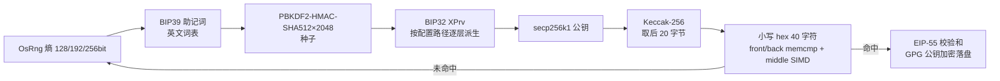

# 以太坊靓号地址生成器

一个完全离线运行的以太坊靓号地址生成器：按 BIP39/BIP32 标准生成助记词与派生地址，
多线程全速搜索符合自定义前缀/中缀/后缀规则的地址，命中后立即用你的 GPG 公钥加密
落盘。熵源只使用操作系统安全随机数（`OsRng`），助记词与私钥全程不落明文、不出内存，
加密文件只有持有对应私钥的人能解开。单二进制交付，行为全部由 `config.yaml` 驱动。

## 安装

```bash
cargo build --release
# 产物：target/release/vanity-generator（或从 Release 页面下载对应平台的压缩包）
```

Release 页面提供 Linux（musl，静态链接）/ Windows（MSVC）/ macOS（x86_64 与
Apple Silicon）的预编译二进制，解压后与 config.yaml 放在同一目录即可直接运行。

## 使用

可执行文件与 `config.yaml` 放在同一目录，直接运行：

```bash
./vanity-generator                 # 读取同目录 config.yaml
./vanity-generator --config /path/to/config.yaml
```

也支持环境变量注入（优先级高于同目录文件，适合 CI 与容器）：

- `VANITY_CONFIG`：config.yaml 的**完整内容**
- `VANITY_GPG_KEY`：GPG 公钥 armor 的**完整内容**（优先于 `gpg_key_file` 字段）

config.yaml 完整示例（仓库根目录同附 `config.example.yaml`）：

```yaml
# 助记词词数：只允许 12 / 18 / 24
word_count: 24
# 靓号规则（至少定义一个）：front 前缀 / middle 任意包含 / back 后缀
# 去掉 0x 后匹配；同时定义时必须同时满足
front: "8888"
back: "8888"
# 大小写敏感（默认 false）：true 时按 EIP-55 校验和形式匹配，
# 如 front: "AaAaAa" 只命中 0xAaAaAa…，0xaaaaaa… 不命中
case_sensitive: false
# 每尝试 N 次输出一行进度（总数/速率/耗时）；false 禁用
progress_every: 100000
# BIP32 派生路径，不填默认 m/44'/60'/0'/0/0
path: "m/44'/60'/0'/0/0"
# 目标命中数量（1..=1000），每命中一个立即加密落盘后继续
count: 5
# GPG 公钥文件（相对可执行文件目录，后缀名不限，纯文本 armor 即可）
gpg_key_file: "fx1024.asc"
```

命中后生成的 `vanity_日期_时间_序号.asc` 是 ASCII Armor 加密文件，可在任何装有
GnuPG 的机器上解密：`gpg --decrypt vanity_xxx.asc > wallet.txt`。

只想验证配置而不开始搜索：`./vanity-generator --check`，会输出规则难度预估
（期望尝试次数与参考耗时），难度过高会直接提示。

## CI 多机并行演示

仓库自带手动触发的多机并行工作流（Actions → 靓号演示（多机并行·共同目标）→ Run workflow）：

1. 在仓库 Settings → Secrets and variables → Actions 配置两个 Secret：
   - `config`：config.yaml 的完整内容
   - `gpg`：GPG 公钥 armor 的完整内容
2. 触发时可选：**并行机器数**（1-20，默认 8）与每台机器的搜索时限（默认 15 分钟）
3. **共同目标机制**：全部机器共同凑齐 config 中 `count` 指定的地址数量。
   每台机器命中后立即把加密产物上传到演示 Release，所有机器每 5 秒轮询
   全局命中数，达标即全部停止（在途的超额命中会保留，通常不超过机器数）。
   机器错峰启动（8 秒/台），低难度规则下可精确停在目标数量
4. 演示产物发布在固定的**预发布 Release `demo-latest`**（prerelease，
   不占用 Latest），只复用这一个标签，不随运行次数堆积标签；
   各机器运行日志作为附件（log-machine-*.log）一并发布

注意：规则难度请控制在演示时限内可完成的范围（启动日志会打印"期望尝试"一行，
也可以先在本地用 `--check` 预估）。参考：单机约 450 次/秒，8 台机器并行时
4 位前缀（期望 6.5 万次）秒级完成，5 位（约 100 万次）数分钟，6 位起建议大幅延长时间。

## 常见问题

- **演示一直不命中**：先看演示 Release 附件 log-machine-1.log 中"期望尝试"一行；
  若参考耗时远超时限，属规则过难，请缩短前/后缀或加长时限。
- **规则难度怎么估**：前缀/后缀每多一位 hex 字符，期望次数 ×16；
  大小写敏感时每个字母位再 ×2；前缀与后缀叠加相乘。
- **如何生成自己的 GPG 公钥**：`gpg --armor --export 你的邮箱 > mykey.asc`，
  把文件内容整个放进 `gpg` Secret 或与二进制同目录。
- **Windows**：解压 zip 后，把 config.example.yaml 改名为 config.yaml，
  与 vanity-generator.exe 放同一目录再运行（或在 PowerShell 里 `.\vanity-generator.exe --check` 验证）。
- **进度行没有出现**：确认 config 里 `progress_every` 为正整数（如 1000），`false` 为关闭。

## 工作原理



每次尝试从熵开始完整走一遍 BIP39 → BIP32 → secp256k1 → Keccak 链路（与
MetaMask 行为对齐：英文词表、空 passphrase、m/44'/60'/0'/0/0）。命中前地址
匹配全部在栈上 40 字节缓冲内完成，零堆分配；命中后才计算 EIP-55 校验和并进入
加密流程，未命中的敏感数据随作用域结束擦除（Zeroizing）。

## 性能

基准环境：2 vCPU 云虚拟机（实测等效约 1 个物理核）。
单次尝试成本分解（`examples/perf_probe`，24 词）：
PBKDF2×2048 轮 1.77ms（77%）+ BIP32 派生 0.40ms + 公钥/Keccak/匹配 0.18ms，
合计约 2.3ms/次。PBKDF2 是 BIP39 标准的固定成本，本项目不做任何省略，
详见 `docs/performance.md`（含优化 A/B 记录与浏览器工具对比说明）。

| 配置 | 吞吐 |
|---|---|
| 单核（24 词） | 约 450 addr/s |
| N 核机器（默认全速多线程） | 约 380×N addr/s（扩展性 ≥ 0.7×N，CI 真多核门禁验证） |
| 12 词（单核） | 约 460 addr/s（词数对成本影响很小） |
| 匹配器单次判定（front 剪枝） | 约 15 ns |

预期查找时间（按单核 450 addr/s，16^n 均匀分布取期望值；多核按核数近线性折算）：

| 前缀长度 | 期望尝试次数 | 单核期望耗时 | 8 核期望耗时 |
|---|---|---|---|
| 2 位 | 256 | 约 0.6 秒 | 约 0.1 秒 |
| 4 位 | 65 536 | 约 2.4 分钟 | 约 18 秒 |
| 6 位 | 1 677 万 | 约 10 小时 | 约 1.3 小时 |
| 8 位 | 43 亿 | 约 111 天 | 约 14 天 |

## 安全说明

- **完全离线**：除读写本地文件外无任何网络行为，私钥不离开内存。
- **熵源**：仅使用操作系统安全随机数（`getrandom`/`OsRng`），熵源失败时
  fail-closed 直接终止，绝不降级。对照 Profanity 事故：其 32 位用户态熵被
  2^32 枚举攻破，本工具不存在此类缩短路径。
- **加密输出**：结果用你的 GPG 公钥（sequoia-openpgp 实现，输出与 GnuPG 兼容）
  加密后落盘，运行机器上不会出现明文助记词文件。
- **内存擦除**：熵、种子、助记词、加密前明文均用 Zeroizing 包裹，用完即擦。
- **长靓号的代价**：前缀每多一位，期望尝试次数 ×16；被破解的难度随之下降，
  请按需选择长度，避免为炫技搜索超长前缀。

## 测试

| 层级 | 内容 |
|---|---|
| 单元 | BIP39 官方向量（12/18/24 词）、BIP32 官方向量 1、确定性派生地址（与独立 Python 实现双互验）、EIP-55 官方样例、私钥边界 0/n 拒绝、非法配置矩阵 |
| 集成 | gpg 命令行生成密钥→本工具加密→gpg 解密回验；fx1024 包结构校验；确定性 RNG 10000 次可重现；2 字符前缀 10000 次内命中 |
| 基准 | criterion：匹配器分解耗时、单线程全链路、2/4/8 线程吞吐（多线程加速比 ≥ 0.7×线程数） |

本地运行：`cargo test`（快速）、`cargo test --release -- --ignored`（重量级）、
`cargo bench`。

## 许可证

MIT
